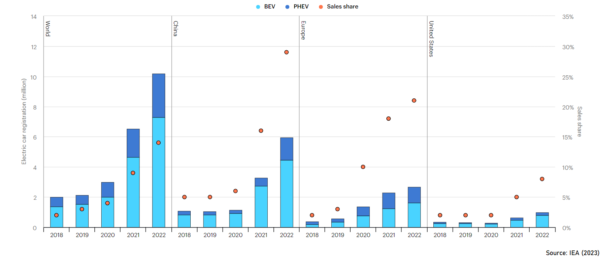

# Battery Vehicle Fleet, Brazil 2050

## Author
**Julio M Barros**  
Master's Degree, Columbia University 2021

## Overview

This repository contains the analysis and projections for the Battery Vehicle Fleet in Brazil by the year 2050. The study explores the current trends, future projections, and various scenarios influencing the adoption of electric vehicles (EVs) in Brazil. It aims to provide insights for policymakers, industry stakeholders, and researchers interested in the transition towards a more sustainable transportation system.

## Table of Contents

1. [Introduction](#introduction)
   - [Global Context](#global-context)
   - [Brazilian Context](#brazilian-context)
   - [Terminology](#terminology)
   - [EV Sales Share](#ev-sales-share---world-and-major-economies)
2. [Fleet Analysis](#fleet-analysis)
   - [Fleet Calculation](#fleet-calculation)
   - [Survival Function (Scrapping)](#survival-function-scrapping)
   - [Modeling](#modeling)
3. [Projections](#projections)
   - [Assumptions](#assumptions)
   - [Scenarios](#scenarios)
     - [Base Scenario](#base-scenario)
     - [Global Convergence Scenario](#global-convergence-scenario)
     - [Biofuels Scenario](#biofuels-scenario)
4. [Fleet 2050](#fleet-2050)
   - [Base Scenario](#base-scenario-1)
   - [Global Convergence Scenario](#global-convergence-scenario-1)
   - [Biofuels Scenario](#biofuels-scenario-1)
   - [Fleet Share by Scenario](#fleet-share-by-scenario)
5. [Conclusion](#conclusion)
6. [References](#references)

## Introduction

### Global Context

- **Growing EV Sales**: Electric vehicles (EVs) are increasingly becoming a viable alternative to internal combustion engine (ICE) vehicles.
- **Fleet Growth**: The vehicle fleet is projected to grow significantly from 1 million to 10 million within five years.
- **Market Share**: EVs held a 14% market share in 2022, marking a tenfold increase over five years.
- **Global Market Size**: In 2022, EVs accounted for 14% of global car sales (USD 425 billion), a 50% increase from 2021, mainly driven by China (60%), Europe (15%), and the USA (8%).
- **Model Diversity**: The number of EV models doubled between 2018 and 2022.
- **Government Commitments**: Legislative advancements, such as the Inflation Reduction Act in the USA, are strengthening the EV market.
- **Supply Challenges**:
  - **Battery Demand**: Li-ion battery demand surged by 65% in 2022.
  - **Component Demand**: In 2022, EVs required 60% lithium, 30% cobalt, and 10% nickel, up from 15%, 10%, and 2% in 2017.
  - **Manufacturing Concentration**: EV manufacturing is heavily concentrated in regions like China.

### Brazilian Context

- **Market Size**: EVs represent a smaller portion of the market, accounting for 2.5% of sales in 2022.
- **Regulatory Landscape**: Current regulations do not set specific electrification targets.
  - **Proconve**: Focuses on reducing certain pollutants.
  - **Rota 2030**: Emphasizes energy efficiency and offers reduced IPI for EVs.
  - **Future Prospects**: Potential for a new Rota 2030 phase with a stronger focus on electromobility.
- **Biofuels**: Considered a viable alternative for net-zero scenarios due to existing domestic production, installed capacity, and widespread flex-fuel technology.
- **Entry Barriers**:
  - **Raw Materials**: Limited availability, high costs, and challenges in domestic manufacturing.
  - **Regulatory Framework**: Complexities in the existing structure.
  - **Skilled Labor**: Shortage of qualified workforce.
  - **Costs and Prices**: High initial investments.
  - **Industry Development**: Need for a robust internal industry.
- **Electric Parity**: Projected to be achieved between 2029-2035[^1].

### Terminology

- **Internal Combustion Engine (ICE)**: Vehicles powered by gasoline, alcohol, flex, and diesel.
- **Battery Electric Vehicles (BEVs)**: 100% electric vehicles that do not use an internal combustion engine.
- **Hybrids**[^2]:
  - **Mild Hybrid Electric Vehicle (MHEV)**: Equipped with a low-voltage electric motor with limited power.
  - **Hybrid Electric Vehicle (HEV)**: Medium power, supporting low speeds.
  - **Plug-in Hybrid Electric Vehicle (PHEV)**: High power, allowing high speeds.
- **Electric Vehicles (EVs)**: Includes BEVs and hybrids. Does not include hydrogen fuel cell vehicles.

### EV Sales Share -- World and Major Economies

{#fig:6_3_evolution_sells}

### Hybrid and BEV Registrations

{#fig:6_5_brazil_EVregistration_2015_2022}

### Registration Composition -- Brazil

{#fig:6_4_brazil_registration_2015_2022}

### Light Vehicle Sales, 2022

{#fig:6_1_ev_sales2022}

### Sales History, Brazil

{#fig:6_2_brazil_growth_sales}

## Fleet Analysis

### Fleet Calculation

Based on licensing data, the circulating fleet $$F$$ at a given moment $$j$$ is calculated by considering:
1. New vehicles licensed in the $$n$$ years prior to $$j$$.
2. The exit of vehicles from the fleet, or the "survival rate" of vehicles with age $$t$$, $$S_t$$.

$$
F_j = \sum_{n=1}^{j} V_{n} \times (1 - S(t))
$$

**Survival Rate Formulations**:
- **Otto Cycle**: $$S(t) = e^{-e^{\alpha+\beta(a)}}$$
- **Diesel Cycle**: $$S(t) = \frac{1}{1 + e^{\alpha(a - a_0)}} + \frac{1}{1 + e^{\alpha(a + a_0)}}$$

**Constants**:
- $$\alpha = 1.798$$ for automobiles; $$\alpha = 0.17$$ for light commercial vehicles with Diesel cycle.
- $$\beta = -0.137$$ for automobiles; $$\beta = -0.141$$ for light commercial vehicles (except those with Diesel cycle).
- $$a_0 = 15.3$$ for light commercial vehicles with Diesel cycle.

### Survival Function (Scrapping)

{#fig:6_6_exit_example}

### Modeling

{#fig:6_7_fleet_model}

<!--
*Note: The fleet modeled for 2022 is 41.4M.*
-->

## Projections

### Assumptions

#### Scenarios

1. **Base Scenario**:
   - Follows the assumptions of the Climate Center of COPPE/UFRJ.
   - Linear decline in ICE vehicle commercialization until 2045.
   - Gradual increase in EVs with hybrids initially favored until 2045, followed by accelerated BEV adoption.

2. **Global Convergence Scenario**:
   - Similar to the base scenario.
   - Accelerated BEV expansion aligning with major global markets by the 2030s.
   - Adapted from ANFAVEA/BCG studies.

3. **Biofuels Scenario**:
   - Based on EPE studies.
   - Despite EV adoption, biofuels remain resilient due to existing installed capacity and widespread flex-fuel technology.

**Common Assumption Across All Scenarios**:
- End of commercialization of gasoline-only vehicles by 2035.

### Base Scenario

{#fig:4_1_premises_base_scenario}

### Global Convergence Scenario

{#fig:5_1_premises_base_convergence}

### Biofuels Scenario

{#fig:7_1_premises_biofuels}

## Fleet 2050

### Base Scenario

{#fig:4_2_fleet_base}

### Global Convergence Scenario

{#fig:5_2_fleet_convergence}

### Biofuels Scenario

{#fig:7_2_fleet_biofuels}

### Fleet Share by Scenario

#### Base Scenario, Fleet Share

{#fig:4_3_fleet_base_selectedYears}

#### Global Convergence Scenario, Fleet Share

{#fig:5_3_fleet_convergence_selectedYears}

#### Biofuels Scenario, Fleet Share

{#fig:5_3_fleet_convergence_selectedYears}

## Conclusion

- **Fleet Projection for 2050**: Estimated at 81.5 million passenger and light commercial vehicles.
- **BEV Fleet Projection**: Ranges between 6 million and 25 million, depending on the scenario.
- **Fleet Share in 2050**: Expected to vary between 8% and 30%, influenced by policies favoring biofuels or electric vehicles.

## References

[^1]: ANFAVEA, BCG (2023)
[^2]: ANFAVEA (2023)
